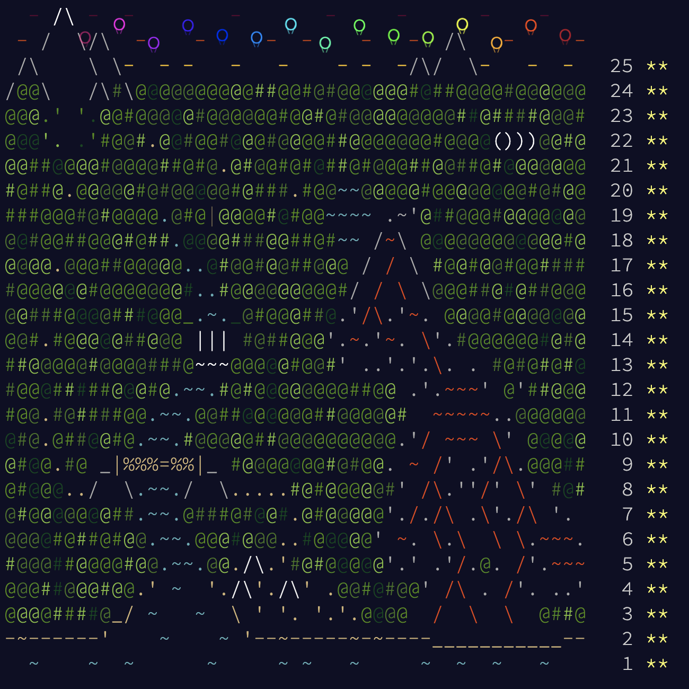

# Advent of Code 2022 in Rust

These are my solutions to the 25 challanges of [Advent of Code](https://adventofcode.com/2022).

The focus was primarly getting to know Rust and learn the *rusty way*.

## Complete map

## Author

Davide Fassio ([@Davidefassio](https://github.com/Davidefassio))
